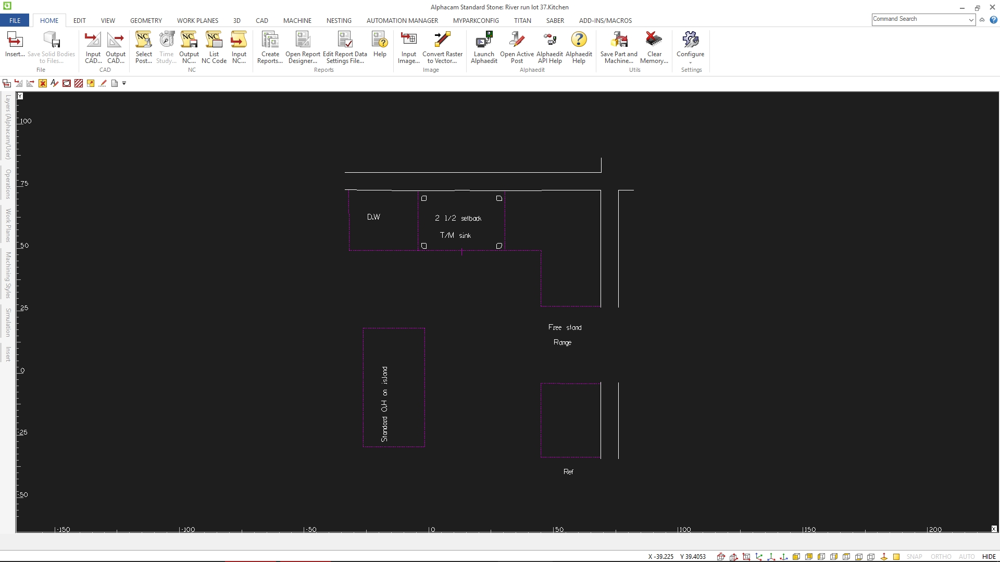
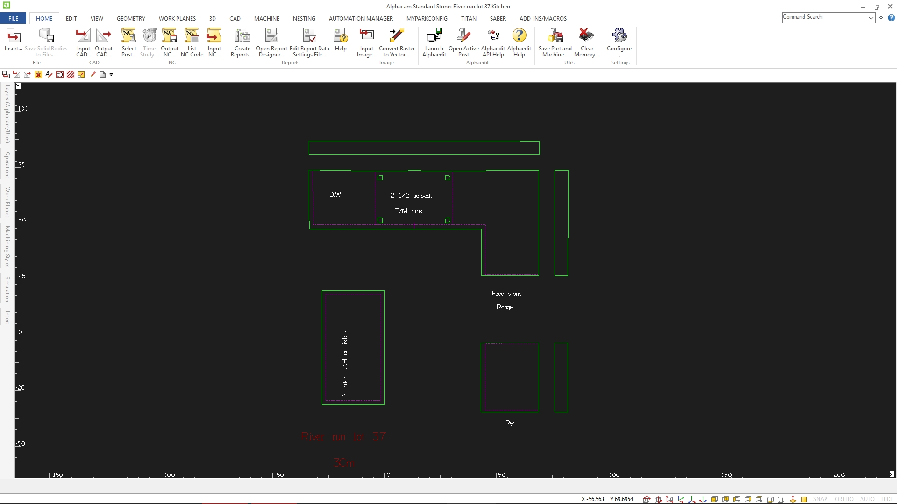

Once imported, you will see a file similar looking to this one

Each color is a different layer and means something different. Usually, red means finished edge, green means flat polish, orange is for seams/miters, dashed white/black is for cabinet lines, and solid white/black is for walls and the sink center line

Begin by hiding all layers. We're going to first delete the lines we dont need

Start by unhiding the layer that the templator's dimensions are in, and delete them all. We will not ever be using the templator's dimensions, they are only for the templator to use to confirm their template is correct on site.

After dimensions are deleted, unhide the gray layer and delete any lines that are in the gray layer.

Once deleted, we can begin defining our construction(reference) lines. These lines will not be seen by the machines and will only be used in our cover sheet file. We use reference lines as points of measure, visual guidance, and for placing our CNC toolpaths in when creating our cover sheet file.

First, unhide the dashed black/cabinet line layer, and change `ctrl + h` them all to construction. Then, unhide the solid black/wall layer, and change the sink/cooktop centerlines to construction as well

It should look like this now

Now we're finished creating reference lines, so now let's define what we want cut out.

Firstly, unhide all of your layers, then hide **just** your construction lines. Now, change `ctrl + h` everything to Geometry. You should now be able to unhide your construction layer and everything should look something like this

Now is a good time to make sure that all of your lines are joined together, and that there are no common lines.
Common lines are multiple lines that are on top of each other and look like a single line because of it. To ensure everything is joined together and that there are no common lines, we'll use the common line removal tool. The common line removal tool can be found in `Geometry -> Special Funtions -> Common Line Removal`