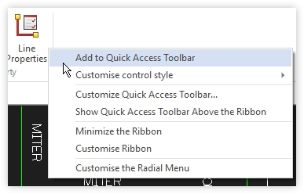

# Alphacam Basics

Alphacam can be an intimidating, however, with the provided hotkeys \(as well as the ability to create your own custom hotkeys\), you can very easily get started without spending __too__ much time learning the locations of every tool and action.

## Alphacam Keybinds

* `x` - Explode
* `f` - Fillet
* `c` - Copy
* `t` - Trim
* `d` - Delete
* `o` - Offset
* `m` - Move
* `s` - Set material
* `F1` - Help
* `F2` - Auto Snap On/Off
* `F3` - Ortho Mode On/Off
* `F4` - Close and Finish
* `F5` - Grid Snap On/Off
* `F6` - Snap to End Point
* `F7` - Snap to Mid Point
* `F8` - Snap to Center
* `F9` - Snap to Intersection
* `F10` - Snap to Tangent
* `F11` - Snap to Perpendicular
* `F12` - Snap to Parallel
* `Shift + T` - Tool directions
* `Ctrl + N` - New File
* `Ctrl + O` - Open File
* `Ctrl + Insert` - Insert Alphacam Drawing
* `Ctrl + S` - Save
* `Ctrl + P` - Printer/Plotter
* `Ctrl + Z` - Undo
* `Ctrl + H` - Change
* `Ctrl + A` - Zoom All
* `Ctrl + R` - Rotate
* `Ctrl + G` - Ghost Tools
* `Ctrl + T` - Text
* `Ctrl + D` - Dimension

## Alphacam Tools

AlphaCAM's tools are organized by tabs, and you can take tools from those tabs and create ribbon shortcuts for them up at the top.
To create a tool shortcut on the ribbon, right click a tool and select `Add to Quick Access Toolbar`

### Home
* Insert - Allows you to import other alphacam `.asd` files into your drawing
* Input CAD - Allows you to import `.dxf` files into your drawing (Inserts them at 0,0)
* Output CAD - Exports your drawing to dxf
* Configure - Allows you to reach AlphaCAM's core settings

### Edit
* Move - Move your selection
* Copy - Copy yout selection
* Rotate - Rotate selections
* Mirror - Mirror selection
* Scale - Scales selection. Number inputted is what the selection dimensions will be multiplied by to get the result. (Line is 1", scale by 0.3 and it will make the line 1 * 0.3)
* Break - Breaks lines and arcs. You can choose single breaking points or you can use a cutting geometry (Imagine cutting geometry as a blade cutting the lines it passes over)
* Trim - Trim lines based off of your selection. Imagine your selection is the blade and you're cutting through things with it

### View
* Display Options - Enable things like ghost tools, breaks, rapids, etc.
* Background Color - Change your background color

### Geometry
* Line - Draw a line
* Arc - Includes several options on arcs you could draw

## Layers

AlphaCAM's different layers can be a bit hard to get a grasp of at first, but after a while you'll know exactly what they're for. Below are descriptions for the layers we use most

### Geometry

The geometry layer is the green layer by default. Think of this layer as anything you are cutting. Use this layer when you're cutting something out, like a countertop or a sink. The files we create will use these lines for cutting & toolpaths for the CNC

### Construction

The construction layer is the purple layer by default. Construction layer is a reference line layer. We use this for any lines that arent being cut, and only want as a reference. Things that will be reference lines are cabinet lines, sink center lines, CNC toolpaths \(When creating our cover sheet\), and anything else we may want in our drawing but don't necessarily want cut out or used on any of the machines. These lines are typically used as points of measure, and a way to see where things are, like dishwashers and sink areas.

### Dimension

The dimension layer is the white/black layer by default. Your dimension tool will use this layer to create dimensions. It's helpful to have this in a separate layer so that you can hide and unhide them all at once.

### Text

Text goes here.

### User Layers

This layer is user defined. There can be several layers in this tab and the user can make as many as they want to, with any color they want to. The templator creates their own colored layers to get the colors we see when we first import the template. You will hardly, if ever, need to create a user layer for anything. You will mostly be going to user layers to clean up your file, and to interact with the templator's layers. But if you need to, user layer tools are in the CAD tab in AlphaCAM. You can change lines and arcs to a specified user layer by right clicking on the layer you want to change, and setting it as active. Then, in your change tool, select `to -> active user layer`, and press enter.

