# Creating Seams

One thing you will need to do is create any needed seams. Sometimes our slabs are not big enough to fit a piece of the counter top onto one slab. This is when you must add seams. 

## Finding your seam location

### CounterGo (Home Owner Only)

The first thing you want to do is go into Moraware, where the job information is, and verify that a quote is available for you to look at. The quote section is right above the files section, where you downloaded the zip containing the job content.  
Once found, right click on the quote and click `View Quote: '123 Example Job Site St.'`

You will be greeted by a layout of the countertops with some dimensions on it. Salespeople use this software to see how many slabs they will need to complete the job, to see what the square footage is, and to organize their costs.
The salespeople will usually create their own seam locations here. You can tell where seams are by looking for dotted lines. Dotted lines in CounterGo represent seam locations.

The best way to think about seam locations in CounterGo is that they're all approximate. Salespeople cannot place seams accurately, and they should not be treated like they're completely accurate. CounterGo is just a platform to give the customer a quote on their countertops, so everything on it, including any dimensions, are approximate. Below are some examples of wrong seam locations in CounterGo, as well as how they should actually look in AlphaCAM.

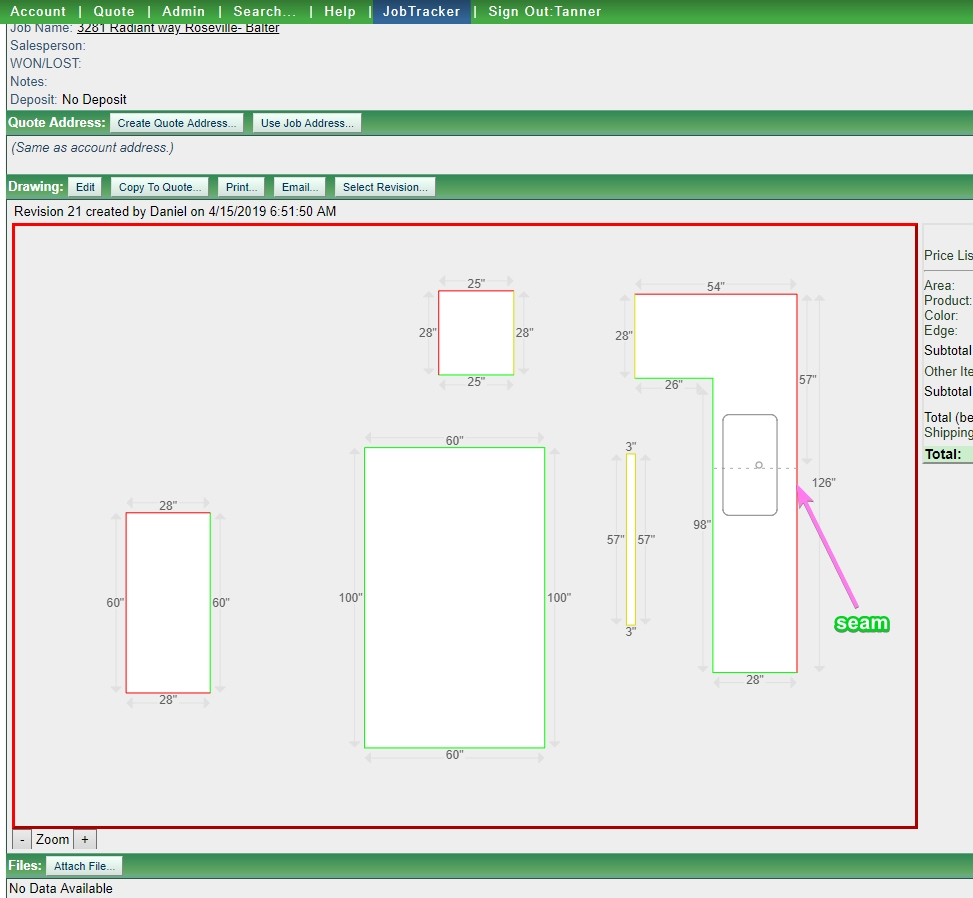

Salespeople will always put a seam where it needs to be in order to fit it onto the slab. But they are not trained in programming, and will often make mistakes that we should avoid making

Here are some common mistakes we should avoid, and how to fix them

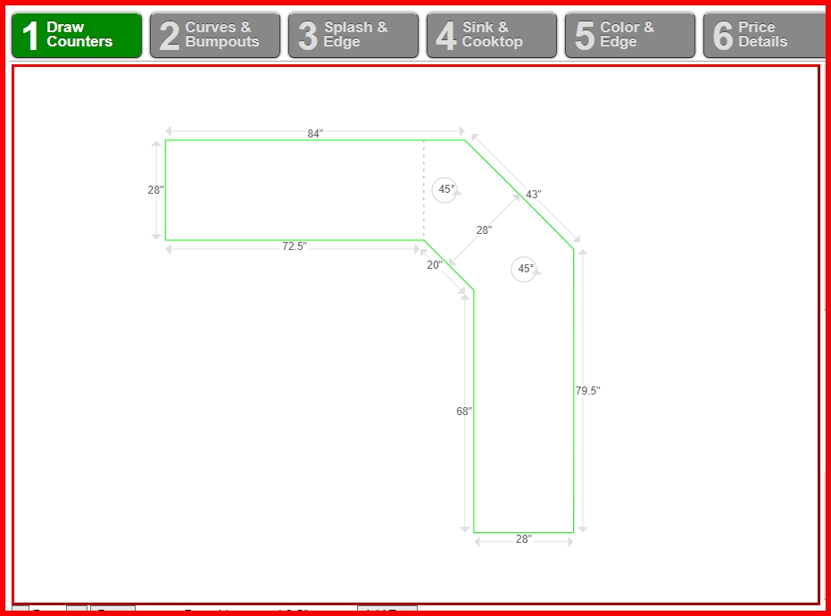

Seams like the above would be a mistake. This is because when we seam up corners, it makes the corner a sharp inside corner. Having one corner be sharp, and the other corner be rounded would be something that could cause us to remake the counters for the customer. Mismatching corners are always a no-go. Below is a proper way to seam up a single inside corner

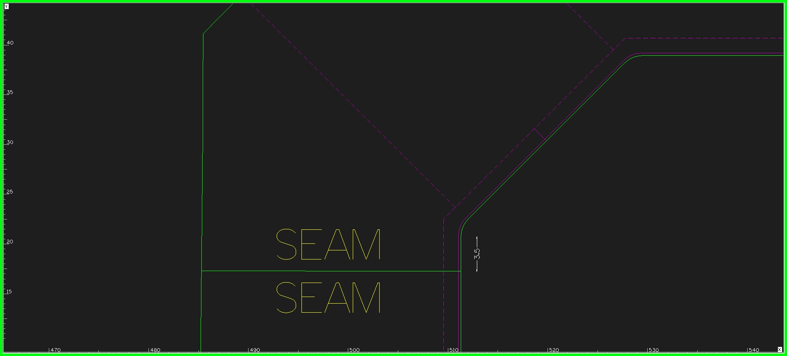

The above is correct because it leaves both corner radiuses equal, instead of one being a sharp corner and the other being a rounded corner. There are rare circumstances, however, where you will need to do a "wrong" single corner seam, but in that case, you'd leave the other inside corner as square as the material would allow (0" for natural stone, 3/8" for Quartz, and 1" for Corian) When doing a single corner seam correctly, ensure to place the seam about 3 1/2" away from the endpoint of the radius. 

Below is an incorrect sink seam location

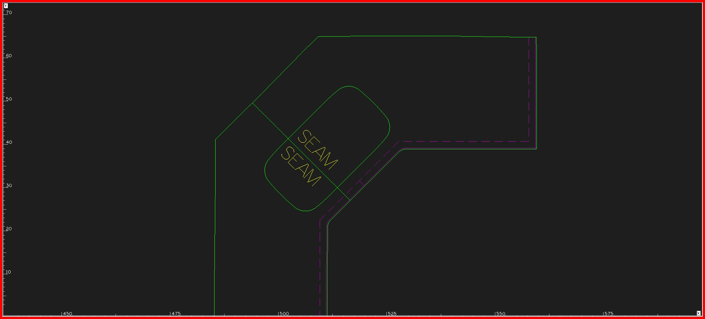

This is wrong because the seam is not going through the center of the sink. In CounterGo, you'll sometimes see the salesperson place a seam down a cooktop or sink, and it wont be perfectly centered with the sink, this is wrong. CounterGo allows you to place seams where ever you want, and it doesnt tell you where the center of the sink is so salespeople can only get their seams *near* where they want it to be, not exactly where they want it to be or exactly where it should be.

### Track Homes

Track homes are very easy to find seam locations for. Because these houses are essentially copy-paste houses, and are all bid with set seam locations, all you have to do is look back at past track homes and copy their seam locations. 

When looking back at past homes, look for track houses that look almost exactly like the one you're programming, then copy it's seam locations. If you cannot find any seam locations, ask for assistance.

### Finding Seam Locations Yourself

Sometimes there may not be a quote or any past homes to look at to get your seam locations, and you'll have to create some seams from scratch. Here are some general rules when looking for places to create your seams.

* Do not place over a dish washer if possible
      * If 3cm material, you **cannot** place a seam over a dishwasher at all. This is due to lack of support at the seams.

* Do not do a Euroseam or a Jog Miter seam if only one inside corner is getting one. *Do not mismatch iside corners*

* If placing multiple seams in a long countertop, do not do the below:
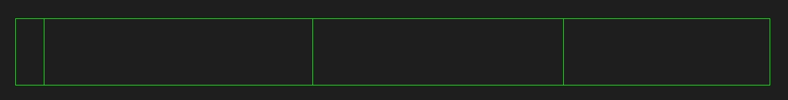
Instead, if you need three seams in a long countertop, make them all equal distance apart, following this guide:
1. Get full measurement of countertop, and divide it by the number of pieces it needs to be in
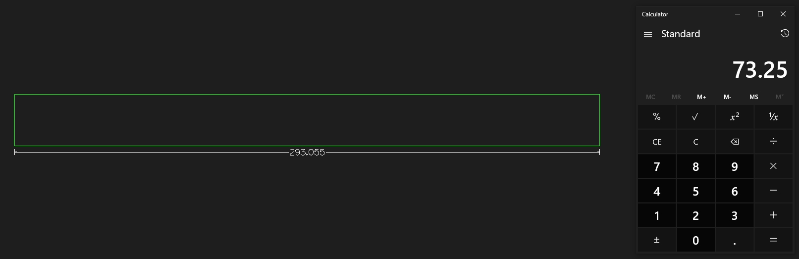
2. Now offset an edge of the countertop by that number, and then offset that line, and so on until you have your seam locations
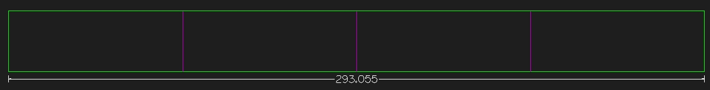
3. The lines you offset are for getting the starting points of your seams. **Do not use these lines as your actual seams as they are crooked!** Using the offset lines, create straight seams starting at the intersection of the offset lines, and the geometry.

* If material is corian, the seam location must be 4" (You can get away with 3 1/2" - 3 1/4") away from any inside corner, dishwasher, and sink.

* If material is granite, dont make pieces too large or in such awkward shapes. Remember that Granite is fragile and heavy. 

## Creating Seams

### Straight

A seam is just a line separating one piece from another so we can fit that countertop on our slabs. Seam placement is important, but once you figure out where to place your seam, you're ready to decide what kind of seam you want to implement. In this example, a regular seam will be made.

Firstly, press `L` to bring out the line tool. Then press `f6` to get to the endpoint of the line you want to make a seam on

Then click to place the starting point of your line there. Then press `f11` to choose a line to make yours perpendicular to

Click on the line you chose the endpoint of to make a line perpendicular to it. Then extend it out passed the other end and right click to make the line.

It's important that you make your line perpendicular to the geometry line you started your seam line on, because these templates are never perfectly straight. If you did something like press `f3` to have a straight horizontal line across, your line would be perfectly straight, but the counter top wouldn't be, therefore making your seam crooked.

next move that seam line to where you want it, if you want it moved at all

Once in place, you can now separate the geometries you need for the seam. To do this, press `b` for break. and check `use cutting geometries`

Then click your seam line and right click to finish your selection. This makes your seam line the break line for anything else you click Then click the geo lines and construction lines you want to break from the original piece.

Now that your pieces are separated, you can now trim down your seam line to fit the counter top.

Press `t` to start trimming down your seam line. Select the outer geometry and right click to finalize your cutting line \(trimming point\)

then click on the parts of your seam line that stick out, and right click

Once trimmed you can move your piece down. To do this, get your move tool \(`m`\), then select the piece you want to move. Right click to finalize your selection, left click to set your base point, and the coordinates you enter should make your new selection an inch away from the other. To do this, when it asks you where to move the selection, go to the bottom and subtract/add one from x or y, then press enter. Then move tool will move your selection an inch in whichever way you chose.

Next you need to copy your seam line.

To do this, press `c` to bring out your copy tool. Then click on your seam line and right click

Press `f6` and click the seam line on one end to make your base point the end of that seam line

Then left click to finalize that base point. Press `f6` again while moving it to move the endpoint of your seam line to the endpoint of the geometry

This is what it should look like

The reason why you copy your seam line is so that you can perfectly replicate the other seam line. If there's even a tiny difference between the two seam lines, the piece will have to be redone.

Now that you seam lines are done, it's now time to offset your seam lines out a quarter of an inch, so that you don't lose any material when the seams are cut. To offset a line, you press `o` and then type .25 \(quarter inch\) as the distance for the offset. Then click on the line you want to offset, and then the direction you want to offset it in. Just like when offsetting inwards a quarter inch when cleaning the file up, except now you're offsetting _outwards_ to account for what's being cut

Now that they're offset outwards, we want these to be our cutting lines, so we have to change them to geometry, and connect the lines to the pieces themselves. Press `ctrl + h` to change your offset construction lines to geometries. _then_ change your original seam lines to construction from geometry lines. it should look like this

Now you need to fillet 0 these new geo lines to the rest of your piece.

And now your basic seam is complete. You know you did it right when you see that **no purple lines extend out to the seam's geometry line**. The reason why you don't want that is because if they do extend out that far, that means when the seams get cut on the CNC machine, you're now taking a quarter inch off each side of the seam, which would make the finished countertop a half inch short, which would ruin the piece and you'd have to redo it all.

### Jog Miters

⚠️ **This seam can only go on inside corners**

### Euroseams

⚠️ **This seam can only go on inside corners**

Euroseams are jog miter seams that we run on the CNC machine

To run a jog miter on a CNC machine, we have to turn it into a euroseam. To change a jog miter to a euroseam, you must begin by using fillet `f` to give the inside corner a 2 1/2" radius.

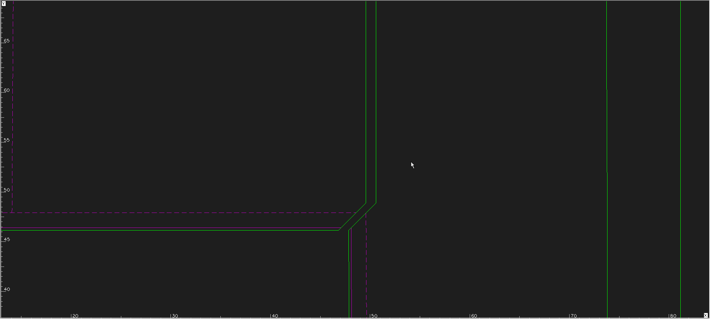

Next, offset `o` the seam a 1/4" outward, so that we have material to take off with the CNC machine, just like we do with our finished edges

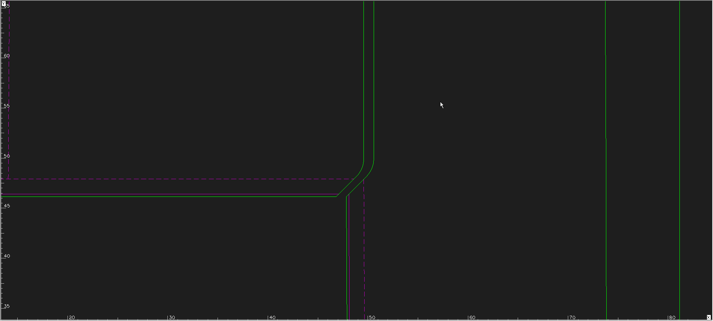

Now all you have to do is fillet `f` the addouts to connect them to the geometry so that they are part of the piece, and then we change the original seam lines to construction lines to use later as CNC toolpaths

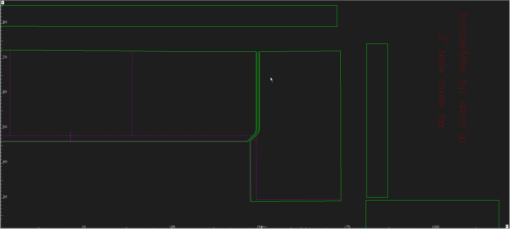

### Straight Miter

⚠️ **This seam can only go on inside corners**

⚠️ **This seam can only be used on Miter edge jobs**

First, use your line tool `L` to begin creating a line

Press `f6` (endpoint of line/arc) to get to the endpoint of the line that goes to the inside corner

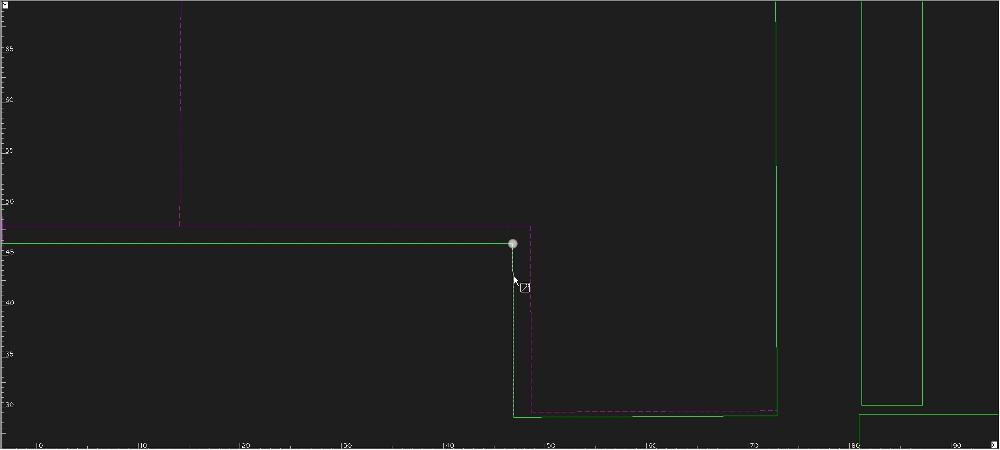

then start your line there, and press `f11` (perpendicular to line/arc), and drag up past the countertop back edge

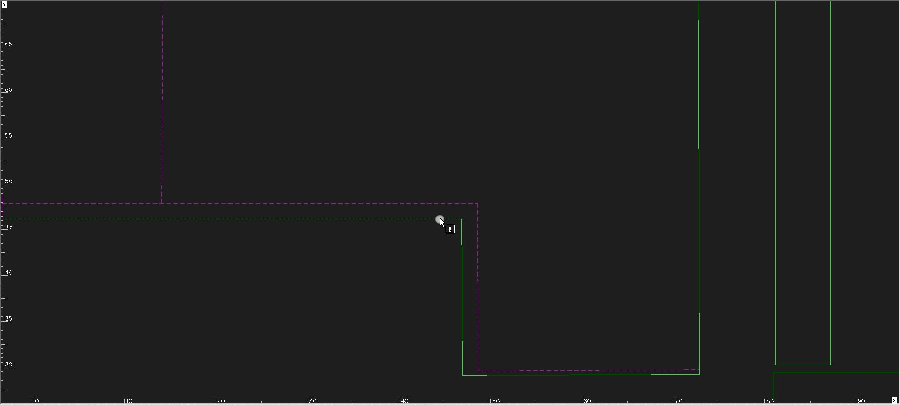

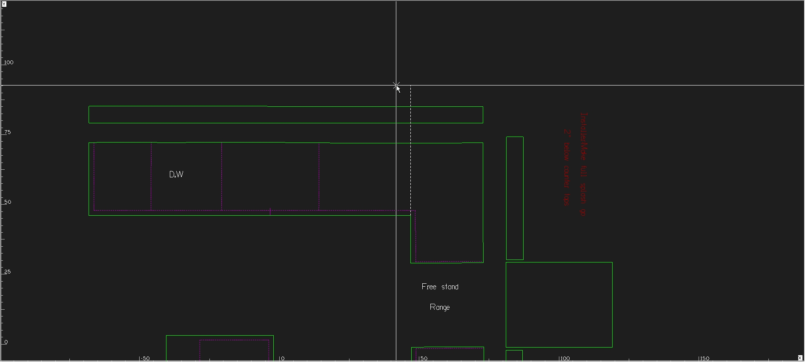

Once you've created your line, use the rotate tool `ctrl + r` and click the base of the seam line (Where it meets the inside corner) using `f6` to get the exact endpoint

Then rotate the seam line either -0.0001 or 0.0001. You'll know which way to rotate it because you do not want the seam line to go out passed either of the pieces.

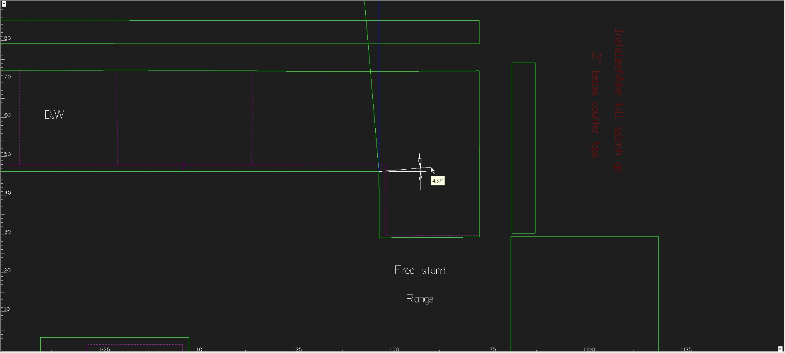

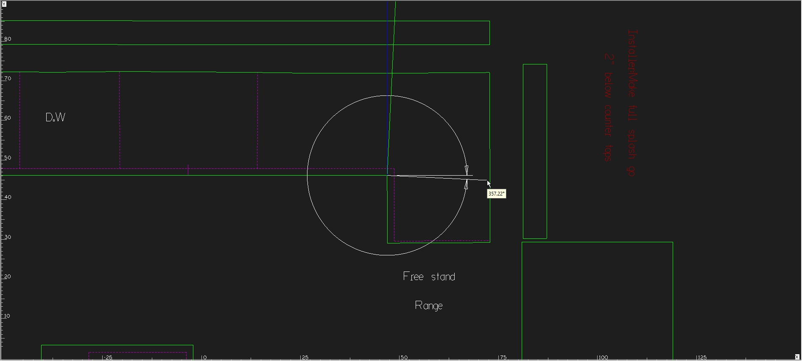

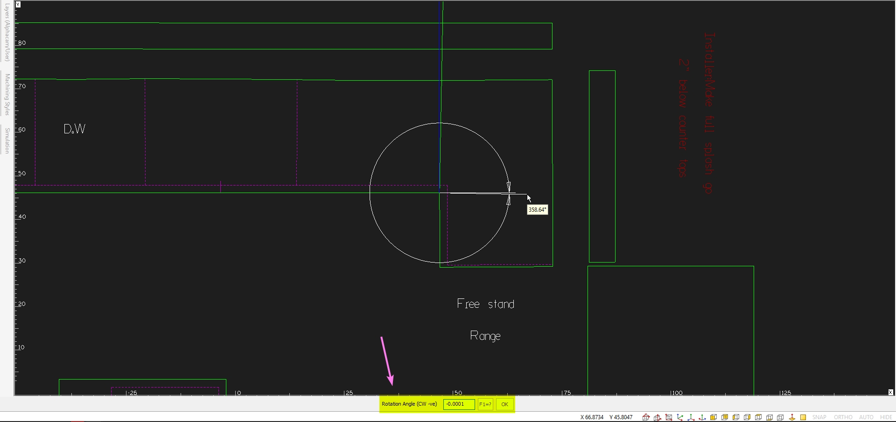

After rotating the seam line, now use the trim tool to trim the seam line to the countertop/splash

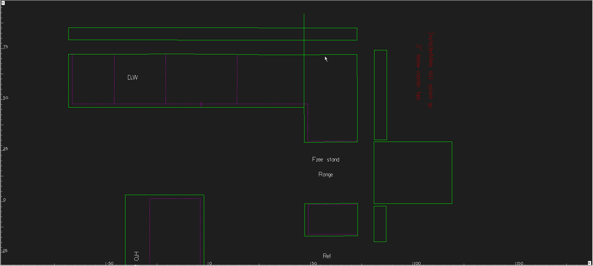

Next you'll need to break apart the countertops using your seam line. Press `b` to initiate the break tool, and use your seam line as a cutting geometry

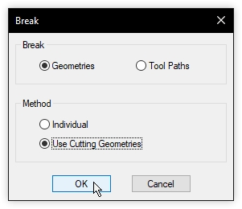

Once your seam lines are selected, right click, and then left click all of the lines you want to break using your seam line. click all lines that pass through them and then right click again to finalize the breaking. 
After the pieces are broken, you can then move one of the pieces over, left/right, up/down. We make pieces separated by an inch. So once you've broke your pieces, move `m` them 1" away.

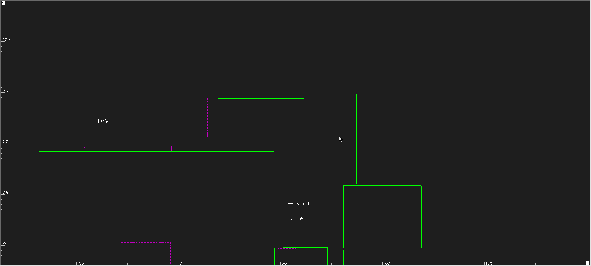

Next, use your copy tool `c` to copy the seam line(s) over to the other piece

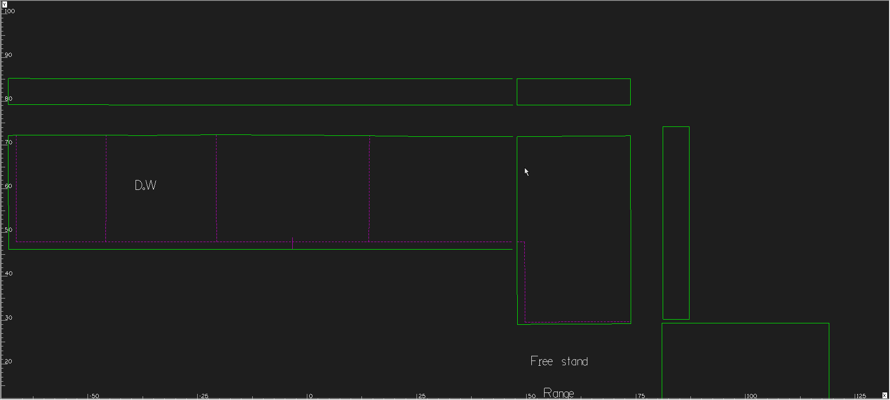

Now all you have to do is join `j` the geometries together and the seam is finished!