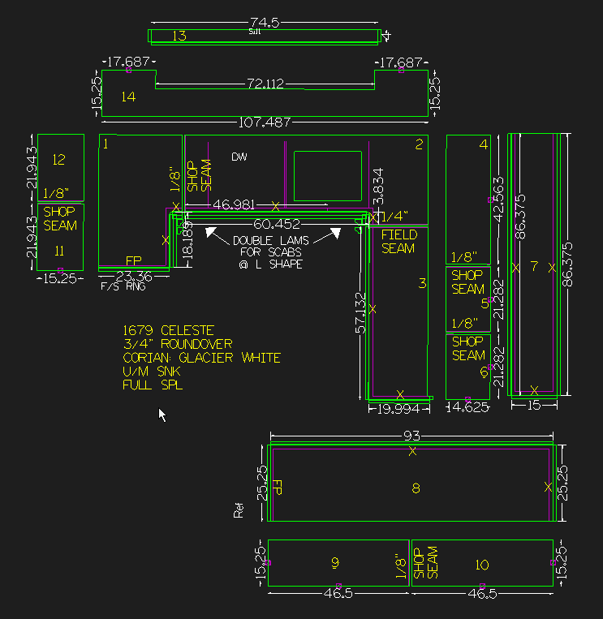

# Corian/LG Hi-Macs Specific Requirements

## Seams

* Seams cannot be less than 4" (Can get away with 3 1/2") away from the following:
    * Dishwashers
    * Sinks
    * Inside Corners
* Shop seams: Seams that are finished and glued together in the shop
    * Should have a 1/8" addout when possible
    * If seam is flush with wall (Flush window sill, for example), make seam addout 3/8"
    * Pieces that are shop seamed together should not be too big. Solid surface is flimsy and breaks often. 
* Field seams: Seams that are put together in the field at time of install
    * Should have a standard addout of 1/4". Could be bigger or smaller, but the standard is 1/4"
    * Use for pieces that would be too big, or impossible to install as one piece.
* Backsplash must also have these addouts

## Corners

* Leave outside corners at 0". outside corner radiuses are done by hand.
* Inside corners must have a minimum of a 1" radius.
    * Only applies to finished edge inside corners.

## Laminations

### Vertical vs. Double Normal Laminations

* Corian is 1/2" Thick
* There are two ways to laminate corian. Vertical laminated, or double laminated.
* Vertical lamination: A single lam strip that is 1" tall, laminated vertically to make the finished edge 1 1/2" thick (Corian is 1/2" thick material)
* Double normal lamination: Normal buildup edge, but cut twice so finished edge can finish at 1 1/2" thick (Corian is 1/2" thick, two lams + material is 1.5")
* When to do a **single vertical lamination**:
    * When Material does *not* have grain flow
    AND
    * When edge detail does not take lots of material off of the edge (Eased, bevel, roundover, etc.)
* When to do a **double normal lamination**:
    * When material has grain flow
    OR
    * When edge detail takes a lot of material off of edge (Ogee ___________, Bullnose, Remick, Pencil, etc.)

### Inside Corner Lamination

When doing inside corner laminations, you must do them the same way we do inside corner lams on other material, except you have to make two of them, because Corian is 1/2" thick and we want it to finish at 1 1/2" thick.

Inside corners should look like this

Notice the double inside corner laminations, and how there are two of them, as well as two sets of **vertical** laminations *just where the inside corners are*.
We made two inside corner laminations to make the edge finish at 1 1/2" thick, but the second set of laminations are not for making the edge finish thicker. When fabricating corian, all seams and inside corners must have some extra support.

Above is one reason why we cut double vertical lams at inside corners. The fabricator will glue the inside corner lams in with the vertical lams, then he will grind the inside lams down to be flush with the vertical lams to create space for the scabs we make. The fabricator will cut out the scabs from the 2nd lamination we cut, and place them behind both the inside corner lam, and the vertical lams next to it, to create some support for the inside corner. He uses a small amount of material for this but he uses the rest of the material (If only a little bit of double vertical lams were cut, create some extra strips) for supporting the shop seams. All shop seams have similar supports.

